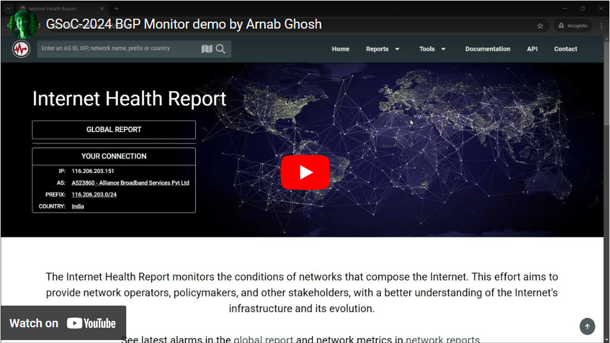

# GSoC'24 Final Report - Arnab Ghosh
##### Organization: Internet Health Report (IHR)
##### Project: Real Time BGP Monitor
##### Project Link: https://summerofcode.withgoogle.com/programs/2024/projects/YOteUEcC
##### Student: Arnab Ghosh
##### Mentors: Romain Fontugne, Dimitrios Panteleimon Giakatos, Emile Aben

## Project Demo
Here is a demo of the tool I developed from scratch in this GSoC'24 project:

<!---->

https://github.com/user-attachments/assets/306baf70-ad15-4442-9880-9ca826918e98

## About the Project
Network operators need to monitor the global reachability of their IP prefixes every time they update their routing policies or make BGP announcements.

This project addresses this need by providing a monitoring dashboard on the IHR website that allows network operators, policymakers, and other
stakeholders to easily track how a prefix propagates across the Internet. The tool takes a prefix from the user, along with a RIS collector and the maximum number of hops from the monitored prefix to display. Once the user presses the 'play' button, the tool connects to RIS Live with the specified parameters and visualizes the AS paths received in a Sankey diagram. The data is continuously updated with new BGP information, ensuring real-time monitoring.

## My Work
* Created a monitoring dashboard using Vue.js, JavaScript, Quasar UI, and Plotly.js.
* Integrated the [RIS Live](https://ris-live.ripe.net/) WebSocket API for primary data collection.
* Wrote optimized JavaScript logic to generate visualization data for AS paths and line charts for BGP announcements and withdrawals.
* Integrated the GitHub API to fetch additional BGP community information from a third-party repository [NLNOG/lg.ring.nlnog.net
](https://github.com/NLNOG/lg.ring.nlnog.net/tree/main/communities), automatically retrieving and processing .txt files with CSV data. This includes filtering out invalid or inconsistent data and extracting valid BGP community descriptions.
* Developed four custom wildcard patterns and regular expressions to identify BGP communities from the fetched data.
* Wrote filtering logic to automatically update BGP peer messages when new data is received or when viewing past BGP messages.
* Added a feature that allows users to view past BGP messages by implementing a timestamp slider or by clicking on a specific timestamp in the line chart, which updates the Sankey diagram and messages table to reflect the data at that particular time.

## Screenshorts

### What code got merged?
My work is in a dedicated branch named [gsoc24](https://github.com/InternetHealthReport/ihr-website/tree/gsoc24), which will later be merged into the master branch.
<!--Initilay the project was in a single file and later it was splited into four separate files and was merged into [dev](https://github.com/InternetHealthReport/ihr-website/tree/dev) branch [PR link](https://github.com/InternetHealthReport/ihr-website/pull/828)-->
Files involved:

* [BGPMonitor.vue](https://github.com/InternetHealthReport/ihr-website/blob/gsoc24/src/views/BGPMonitor.vue)
* [BGPPathsChart.vue](https://github.com/InternetHealthReport/ihr-website/blob/gsoc24/src/components/charts/BGPPathsChart.vue)
* [BGPLineChart.vue](https://github.com/InternetHealthReport/ihr-website/blob/gsoc24/src/components/charts/BGPLineChart.vue)
* [BGPMessagesTable.vue](https://github.com/InternetHealthReport/ihr-website/blob/gsoc24/src/components/tables/BGPMessagesTable.vue)

## What’s left to do?
The primary requirements for this project have been completed, and the first version of the tool is now ready. Below are items left for future versions of the tool:
* Add more charts, for example, the number of AS repetitions over time.
* Currently, the AS info description about a particular AS is fetched from a file [asnames.txt](https://github.com/InternetHealthReport/ihr-website/blob/gsoc24/public/data/asnames.txt), which is outdated. We need to fetch the data from the [IYP](https://github.com/InternetHealthReport/internet-yellow-pages).
* Due to time constraints, the tool currently does not support more or less specific prefixes.

## Final thoughts
I want to extend my sincere thanks to my mentors for always guiding me and creating a friendly environment where I felt comfortable discussing and asking questions. The experience I gained from working on IHR with them has taught me a lot.
